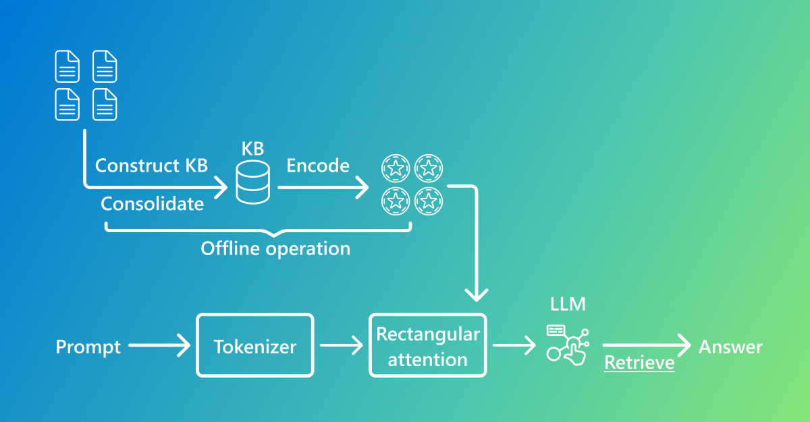

# KBLAM 项目总结与展望

近几个月，我们在 **KBLAM**（Knowledge Base augmented Language Model）项目中进行了部署、调试与深入研究。KBLAM 是微软研究院 2025 年提出的新的知识注入框架，它通过预训练句子编码器和线性适配器将结构化知识库转换为连续的键值向量对（知识令牌），并利用修改过的矩形注意力机制将这些令牌融入预训练的大模型，从而在无需外部检索的情况下直接回答依赖外部知识的问题。本文将对 KBLAM 的原理与实验进行梳理，汇总在国产服务器上部署过程中遇到的问题，总结未来训练计划，讨论中文化方案，并提出针对 KBLAM 的改进思路。

## 一、KBLAM 理论与实验回顾

### 1.1 模型设计

KBLAM 的核心思想是将知识库中的三元组 $\langle \text{name}, \text{property}, \text{value}\rangle$ 映射为与 LLM 键值缓存等尺寸的向量，称为 **知识令牌**。具体过程如下：

1. **知识编码**：对于每个三元组，先用预训练的句子编码器 $f(\cdot)$ 将“\<name\> 的 \<property\>”和“\<value\>”分别映射为 $P$ 维的基础键向量 $k_m = f(\text{property}_m\,\text{of}\, \text{name}_m)$和值向量 $v_m = f(\text{value}_m)$[1]。然后使用线性适配器将其投影到 LLM 每层的键、值空间：$\tilde{k}_m = \tilde{W}_K k_m$，$\tilde{v}_m = \tilde{W}_V v_m$ [1]。每个知识令牌包含 $L$ 层的键和值向量，因此在不同注意力层可以直接使用。

2. **矩形注意力**：在推理时，模型将 $N$ 个提示词表示和 $M$ 个知识令牌送入注意力机制。为了避免 $O((N+M)^2)$ 的复杂度，KBLAM 规定知识令牌之间不相互关注，提示词既可以关注前面的提示词，也可以关注全部知识令牌，从而形成 $(M+N)\times N$ 的矩形注意力矩阵[1]。第 $l$ 层的每个输出向量 $\tilde{y}_n$ 为两部分加权和：一部分来自知识令牌的值向量（按提示词查询向量与知识键的相似度加权），另一部分来自提示词自身的自注意力[1]。此设计使得计算和内存开销随三元组数量线性增长，当 $M\gg N$ 时优势显著[1]。

3. **KB 指令微调**：由于句子编码器与 LLM 的语义空间存在差异，论文通过指令微调仅训练线性适配器和额外的查询头。在训练时，使用 GPT 合成的大规模知识库（约 45k 个名称、135k 条三元组）生成问题–答案样本，通过最大化 $\log p_\theta(A|Q,KB)$ 学习映射，但不调整 LLM 权重[1]。微调使用 AdamW 优化器在单张 A100 GPU 上迭代 2 万步，显示出在不破坏原有推理能力的前提下学会了检索行为和拒答策略[1]。

为了帮助理解 KBLAM 的整体流程，图 1 展示了系统的离线和在线阶段：离线阶段先构建并编码知识库，生成知识令牌；在线阶段将用户提示经分词后输入矩形注意力和 LLM，以检索并生成答案。下面给出矩形注意力的伪代码，演示如何在一个注意力层内结合知识令牌与提示 token：



图 1：KBLAM 在离线阶段构建并编码知识库生成知识令牌，在线阶段通过矩形注意力将提示与知识融合后输入 LLM 输出答案。

#### 1.3 矩形注意力伪代码

```python
def rectangular_attention(Q, K_kb, V_kb, K_text, V_text):
    """
    Q: 查询矩阵，来自提示 token 的隐藏状态，形状 (N, d)
    K_kb, V_kb: 知识库的键和值，形状 (M, d)
    K_text, V_text: 提示 token 的自注意力键和值
    返回：结合知识和提示的输出
    """
    # 计算与知识令牌的注意力权重
    attn_kb = softmax(Q @ K_kb.T / sqrt(d))
    output_kb = attn_kb @ V_kb
    # 计算提示 token 之间的自注意力
    attn_text = softmax(Q @ K_text.T / sqrt(d))
    output_text = attn_text @ V_text
    # 返回两部分之和
    return output_kb + output_text
````

### 1.2 实验结果

* **检索准确性与可解释性**：论文将注意力得分视为隐式检索信号，发现对于问到的三元组，相关问题词的注意力会集中在正确的知识令牌上[1]。在 synthetic 和 Enron 数据集上进行 top‑1/top‑5 检索评估，KBLAM 在大量三元组下仍能准确定位相关条目[1]。
* **问答能力**：在简答、多实体和开放式问答任务中，KBLAM 的答案质量（BERT score 或 GPT‑4 打分）基本与拼接全部三元组的 in‑context learning 持平，但显存开销大幅降低[1]。尤其在 10k 以上三元组时，in‑context learning 因需要 $O((KN)^2)$ 的内存，无法运行，而 KBLAM 仍能保持稳定性能[1]。
* **拒答行为**：KBLAM 可通过注意力自动检测 KB 中是否有答案。实验中，当问题无相关三元组时，模型能生成“抱歉，KB 中没有相关信息”这种拒答，且随着知识库规模扩大，其误拒率增长比 in‑context learning 慢[1]。
* **限制与展望**：论文指出 KBLAM 目前用固定维度向量表示三元组，这可能导致数字、名称等精确信息丢失[1]；合成 KB 与真实数据分布不一致导致泛化下降[1]；未来可探索更复杂的多跳推理指令、信息压缩率控制以及使用真实数据构建合成 KB 等方向[1]。

## 二、国产服务器部署历程与经验

我们的开发环境为麒麟 v10 操作系统和 8 张昇腾 910B NPU，且出于信创和安全要求无法访问外网。这一现实与 KBLAM 原论文所假设的 GPU + GPT/ada‑002 模型环境差异巨大，导致部署过程中需要解决以下主要问题：

1. **合成 KB 与指令数据生成**：原论文使用 GPT 生成随机名称和属性值[1]。由于服务器无法访问 OpenAI，我们改用本地大模型在离线环境下生成虚构实体和属性。经过在 Windows + RTX 2080 Ti 环境对 **Qwen3‑8B**、**Meta‑Llama‑3‑8B‑Instruct** 和 **Meta‑Llama‑3.1‑8B‑Instruct** 等模型的实测，发现 Qwen3‑8B 引入的 *think* 推理机制导致生成速度较慢，而 Llama‑3‑8B 整体性能偏弱。目前 **Meta‑Llama‑3.1‑8B‑Instruct** 在生成质量与效率之间取得较好平衡，因此我们采用该模型生成约 45 k 个英文名称及对应属性。生成过程中严格控制模板随机性，并对所有三元组做英文去重，以保证合成知识的多样性和正确性。

2. **句子编码器替换**：KBLAM 原论文使用 OpenAI 的 ada‑002 embedding 模型（1536 维）[1]。在国产环境无法调用该模型的情况下，我们目前采用开源的 **all‑MiniLM‑L6‑v2** 模型，该模型基于轻量级 MiniLM 编码器，输出 384 维嵌入，能在低资源条件下提供合理的语义表示[3]。由于嵌入维度从 1 536 压缩至 384，我们重新初始化线性适配器并加入归一化层以匹配 LLM 的键值维度。为了进一步提升检索准确率，我们正在调研其他英文开源嵌入模型，例如：

   * **BGE‑base‑en‑v1.5**：基于 BERT 的双编码器，采用硬负样本对比学习，支持查询与文档分别添加前缀，是目前 MTEB 英文任务的强势模型[3]。
   * **E5‑base‑v2**：使用 RoBERTa 双编码器，通过 text‑to‑text 对比训练，在检索、重排序和分类任务中表现均衡[3]。
   * **nomic‑embed‑text‑v1**：由 Nomic AI 训练的 GPT‑式模型，支持更长的输入范围和多语言泛化能力，但参数量较大[3]。
   * **all‑mpnet‑base‑v2** 和 **gtr‑base**：这些模型以 MPNet 或 T5 为基础，输出 768 维嵌入，是社区在问答检索中常用的较大模型。

   我们将对上述模型进行小规模评测，选择适用于 45 k 英文三元组环境下的嵌入方案。研究报告指出，只要重新训练适配器，替换句子编码器不会严重影响 KBLAM 的检索性能[2]。

表 1：开源嵌入模型对比

| 模型                  | 架构           | 输出维度  | 优点           | 缺点          |
| ------------------- | ------------ | ----- | ------------ | ----------- |
| all‑MiniLM‑L6‑v2    | MiniLM (6 层) | 384   | 轻量、速度快       | 长句性能有限      |
| BGE‑base‑en‑v1.5    | BERT         | 768   | 检索效果强，支持前缀指令 | 需要额外前缀，模型较大 |
| E5‑base‑v2          | RoBERTa      | 768   | 表现均衡，无需前缀    | 长文本截断影响性能   |
| nomic‑embed‑text‑v1 | GPT‑式        | ≈1024 | 支持长输入、多语言    | 参数量大、运行慢    |
| all‑mpnet‑base‑v2   | MPNet        | 768   | 高质量检索        | 对资源要求高      |

3. **大模型适配与显存管理**：原论文将 Llama3‑8B 作为 LLM 主干。我们已在个人电脑（Windows + RTX 2080 Ti）上验证可以加载并运行 **Llama‑3‑8B‑Instruct**，说明开源权重在 GPU 环境下能够正常推理。由于昇腾 910B 单卡显存仅 32 GB，服务器部署时需采用 8 卡模型并行与 ZeRO‑2 优化，并使用半精度（FP16）加载权重以控制显存占用；同时将 HuggingFace 权重转换为 MindSpore‑CKPT 格式。为支持矩形注意力，我们计划参考原仓库重写 `masked_add` 和 `softmax` 等底层算子，在 MindSpore 中实现并调优不同批次大小的速度与显存开销。这一适配方案尚处于实验阶段，后续将在服务器上验证其可行性。

4. **生态兼容问题**：麒麟 v10 默认缺少一些深度学习依赖，如 CUBLAS 和 libcusparse，且与 Ascend CANN 驱动存在版本冲突。我们通过编译 MindSpore 2.2 与 PyTorch 2.0（Ascend 适配版本），手工链接 libcann 库，并调整 `LD_LIBRARY_PATH`，同时将 Python 包索引指向内网源，从而解决了依赖安装难题。

综合上述优化，我们在个人电脑上跑通了 KBLAM 的主要实验，正在服务器上试着生成约 45 k 个英文名称和 135 k 条虚构三元组，训练线性适配器并验证推理效果。接下来将把整个训练流程迁移到昇腾 910B 服务器，测试矩形注意力实现和显存占用，并在此基础上进一步完善 KB 构建与模型微调流程。

## 三、接下来的部署训练计划

为了进一步提升性能并验证更多场景，我们计划在现有环境基础上展开以下工作：

1. **多阶段训练**：

   * **阶段 1（基线）**：在目前生成的约 45 k 条英文合成三元组上训练线性适配器。保持单卡 batch size 32，训练约 30 k 步以检查收敛情况，并评估检索准确率、BERT‑Score 与拒答率，作为基线。
   * **阶段 2（扩展 KB）**：逐步将知识库扩展到 5 万、10 万甚至更多条目，在 8 卡数据并行下进行训练，以验证矩形注意力在大规模知识下的可扩展性，监控显存使用与推理延迟[2]。
   * **阶段 3（复杂关系与多跳推理）**：根据调研建议，生成包含实体间关系的知识网络，设计单跳、多跳及冲突推理任务，扩展指令模板让模型解释推理链路[2]。完成此阶段后，将评估模型在多跳推理和冲突判断上的准确率，以及生成解释的连贯性。

2. **嵌入模型选择与对比**：在 all‑MiniLM‑L6‑v2 的基础上，改写代码支持 BGE‑base‑en‑v1.5、E5‑base‑v2、nomic‑embed‑text‑v1、all‑mpnet‑base‑v2 等多种英文嵌入模型，对同一知识库进行训练和评测，横向比较检索准确性与推理质量[3]。

3. **显存与速度分析**：通过分批增加 KB 规模（如 1 k→10 k→50 k→100 k），记录矩形注意力在昇腾 NPU 上的显存使用与推理延时曲线，确定单机可承载的最大 KB 大小，并对不同 KB 下的答案稳定性进行量化分析[2]。

以上计划均以英文数据为主，目前不涉及中文指令或动态更新的实验，待服务器部署稳定后再逐步探索其他方向。

## 四、KBLaM 中文化思路

KBLAM 的原始实现基于英文知识库和英语 LLM。我们目前还没有在中文数据集上验证 KBLAM 的性能，以下内容是面向未来中文化探索的初步构想。为了在国内场景落地，需要对知识表示、编码器及提示工程进行中文化改造：

1. **中文知识库构建**：以公开的中文百科或企业文档为原始语料，通过信息抽取与实体链接生成三元组。针对不同领域（如金融、电力、教育）分别制定实体类型和属性列表，而不仅局限于 "description/目的" 等简单属性[2]。对于真实存在的名称，可添加虚构或矛盾属性，用于测试模型对冲突信息的处理[2]。
2. **中文句子编码器**：选择在大规模中文语料上训练的嵌入模型，例如 **bge‑large‑zh** 或 **sent‑bert‑zh**，并使用 Ascend‑PyTorch 在 NPU 上推理。必要时可微调编码器以更好地捕捉专业领域语义。
3. **中文 LLM 与适配器**：采用开源中文大模型（如 ChatGLM3、Yi‑34B 等）作为 LLM 主体。由于中文模型的词汇表和 positional embedding 与英文模型不同，需要重新训练线性适配器。为避免纯字面翻译的损失，应在指令模板中使用自然的中文表达，比如“请说明……的用途”，“无法在知识库中找到相关信息”等。
4. **多跳推理与链路解释**：中文知识库应包含实体间的关系（三元组不再互相独立），例如 “A 属于 B”、“B 的负责人是 C”。可通过设计问题促使模型进行多跳推理，如“某人是哪个公司负责人的职位是什么？”通过矩形注意力检索多个令牌，再通过 LLM 的生成能力串联推理链。报告建议同时给出推理过程的指令，检验模型是否能解释中间链路[2]。
5. **评测与安全**：除了准确率指标，还需要关注模型的鲁棒性和安全性：对噪声比例、冲突信息的引入量进行控制，观察模型是否会蔓延错误信息；对敏感领域的知识要进行脱敏处理，防止在生成时泄漏真实数据。

## 五、针对 KBLAM 的改进思路与前沿方向

虽然 KBLAM 在增强 LLM 外部知识方面取得突破，但其仍存在不足。结合论文的局限性分析、国内部署经验及最新研究，我们认为未来可从以下方面改进：

1. **引入层次化检索与混合策略**：矩形注意力的开销随知识条目线性增长，但常数项仍较大，当 KB 扩展到几十万甚至百万条三元组时单机显存难以承受。可以借鉴混合检索思想，将 KBLAM 的知识令牌视为向量索引，先利用 FAISS/Annoy 等快速向量库通过稠密或稀疏检索预选出 top‑K 个相关令牌，再将这批令牌送入矩形注意力精排。也可以在 LLM 内部引入 **门控网络**：根据用户问题的查询向量动态选择需要激活的知识块，类似检索单元的混合专家（MoE）机制，从而避免每次都扫描全部知识令牌。这类层次化检索与重排序策略能够显著降低显存和时间成本，同时提高检索质量[2]。
2. **保留结构信息的知识编码**：KBLAM 当前将 “name + property” 与 “value” 拼接后映射为一个固定维度向量，这种池化会丢失词序、数字和关系结构[1]。未来可以探索可变长的 **序列–图编码器**，在编码阶段保留更多结构信息。例如，利用图神经网络对知识库构建实体‑关系图，通过图 Transformer 输出多 token 序列，每个三元组对应多条键值对；或者使用头实体、关系和尾实体分别生成向量序列，再在 LLM 内部注入这些序列，允许注意力在字段内自由流动。另一个方向是借助 **Graph‑of‑Thoughts** 等推理框架，让模型在生成时显式构建中间知识图，从而促进多跳推理。对于包含数字或日期的属性，可以引入专用的数值编码器，使数字被以字符级别或连续值形式注入，以避免信息丢失。通过这些改进，知识令牌不仅包含语义摘要，还承载关系结构，进而提升多跳推理与精确属性生成能力。
3. **自适应压缩与选择机制**：论文提到，可设置压缩率超参数控制知识向量长度[1]。在实践中可以进一步将其设计为可学习机制。例如，引入一个 **重要性评分网络**，根据知识条目的查询频次、置信度或领域相关性对每个令牌分配不同的维度预算，重要条目用更长的向量表示，普通条目用较短表示，甚至在查询无关时直接跳过注入。这类似于知识蒸馏与 MoE 结合：根据问题动态路由不同“专家”或子空间，从而在固定显存下最大化利用率。还可以借鉴可变形注意力中的采样策略，让矩形注意力自适应地采样部分键值以降低计算量。
4. **多样化指令微调与链式推理**：KBLAM 目前的微调数据主要是单跳问答。根据调研报告，后续可扩展指令类型，包括多跳推理、冲突判断、反事实询问以及推理过程解释[2]。训练策略可以分阶段展开：先在生成的 QA 对训练检索和简单问答能力，然后逐步加入需要组合多个知识令牌才能回答的问题，再加入需要识别矛盾信息的样例，最后加入要求输出推理链或理由的任务。为让模型学会链式思考，可以在指令微调中加入 **chain‑of‑thought** 模板或使用 **思维示例** 作为监督信号。也可以采用强化学习或自监督方式，让模型利用自身的注意力权重去对照真实检索结果，不断优化检索和生成模块。这样的分段微调符合模块化与迭代流程：将检索、推理、生成分开训练，并交替优化[2].
5. **结合外部工具与校验机制**：即使使用知识令牌，模型仍可能幻觉或检索不到正确条目，导致回答错误。可以在推理流程末端加入事实核查模块：当模型生成答案时，调用知识图谱推理引擎或 SPARQL 查询验证答案是否与 KB 一致；若不一致，则反馈给模型重新检索或拒答。另一做法是采用链路自洽检查：分析模型选出的知识令牌之间是否存在合理关系，如不存在则降低置信度并触发额外检索。还可以将 RAG 与文档检索结合，利用 web 检索或企业数据库对生成的事实做交叉验证[2]。这些外部校验机制有助于减少幻觉，提高答案的可靠性。
6. **领域适配与开放式模型选择**：调查指出，应根据应用场景选择开源或闭源模型，并针对特定领域构建专用知识库和指令集[2]。例如，在金融、医疗等垂直领域，可以使用领域知识图谱生成三元组，选择较小但聚焦的 LLM（如 FinGPT、MedGPT 等）作为主干模型，然后训练领域适配器。这不仅提高了答案的专业性，也可通过自有模型保障数据隐私。若使用闭源大模型，也可以通过查询代理方式调用外部 API，同时保持知识库在本地管理，实现灵活的开放式模型组合。
7. **中文及多语言扩展**：除了在国内场景落地，未来还可以探索跨语言知识融合。可以采用多语种嵌入模型（如 **multi‑qa‑mpnet‑base‑dot‑v1** 或 **gtr‑xxl**）将不同语言的三元组映射到统一向量空间，使模型能够用中文提问并检索英文或日文的知识令牌。对于跨语境的冲突信息，可通过翻译和对齐模块消解不同语言之间的表述差异，并在知识令牌中存储语言标签，帮助模型选择合适答案。此外，还可以为特定语言训练独立的适配器，在矩形注意力层使用条件选择机制按需加载，从而支持多语言协同检索和生成。

## 结语

KBLAM 提出了利用知识令牌和矩形注意力将外部知识无缝融入大模型的新范式，既保持了 end‑to‑end 的生成能力，又解决了传统 RAG 的检索瓶颈。在我们的国产服务器上部署实践中，虽然面对无法联网、硬件架构差异、中文化需求等挑战，但通过替换句子编码器与 LLM、改写注意力算子、设计本地合成数据等手段，我们成功验证了 KBLAM 的可行性，并规划了下一阶段训练计划。未来，随着混合检索、结构化编码、自适应压缩和链式推理等技术的发展，KBLAM 有望成为连接知识库与大模型的高效桥梁，为企业知识管理与智能问答带来更强的解释性和扩展性。

## 参考文献

[1] Taketomo Isazawa, Xi Wang, Liana Mikaelyan, Mathew Salvaris, James Hensman. “KBLaM: Knowledge Base Augmented Language Model.” *Proceedings of* 2025.

[2] 知识库融入大模型调研. 《知识库融入大模型调研》，2023。

[3] Naman Bansal. “Best Open‑Source Embedding Models Benchmarked and Ranked.” *Supermemory Blog*, 2025.

[4] Microsoft Research. “Introducing KBLaM: Bringing plug‑and‑play external knowledge to LLMs.” *Microsoft Research Blog*, 2025.