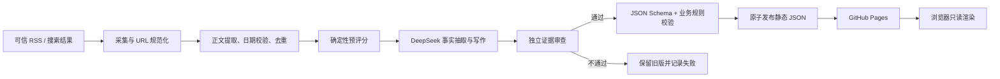

# 技术架构

## 1. 总体方案

GitHub Pages 只负责静态展示；GitHub Actions 充当定时后端。这样既不暴露 DeepSeek 密钥，也不引入需要长期维护的服务器。



## 2. 目录边界

```text
assets/ai-startup/          页面专属 CSS/JS
data/ai/startup/            仅存已验证、可公开的数据
  opportunities/
  cases/
tools/startup/              采集、LLM、验证、发布与测试
.github/workflows/          日报、案例与 Pages 部署
docs/ai-startup/            产品、架构、运维与验收记录
```

## 3. 流水线阶段

1. **Collect**：并发读取受控 RSS；可选 Brave Search；设置超时、重试和 User-Agent。
2. **Normalize**：仅允许 HTTPS/HTTP 公网地址；移除跟踪参数；按 canonical URL 与标题指纹去重。
3. **Filter**：发布日期、来源级别、商业信号、可验证性和 AI 必要性预评分。
4. **Extract**：DeepSeek 只从输入证据提取结构化事实；缺失则标记未知。
5. **Compose**：依据数据契约生成日报或动态案例章节。
6. **Verify**：第二次独立调用逐条检查来源覆盖、数字、日期、越界推断和禁用措辞。
7. **Publish**：Ajv 与业务规则全部通过后，先写临时文件再 rename；失败时不动线上最新版。

## 4. DeepSeek 接入

- 默认模型：`deepseek-v4-flash`。
- 密钥仅来自 GitHub Actions Secret `DEEPSEEK_API_KEY`。
- 默认尝试 Responses API 的结构化输出；保留 Chat Completions 兼容降级。
- 温度保持低值；不通过“分段生成后拼接”制造逻辑断裂。
- 网络调用必须带 AbortController、有限重试、指数退避和可诊断错误。

## 5. 发布策略

- 日报：通过全部门禁后自动发布；数量可为 0–10，0 条时保留旧版并输出运行报告。
- 周案例：自动生成到受审草稿；只有通过证据门禁且明确执行 promote 才进入公开索引。首篇种子案例作为黄金样本。
- Pages：现有 `npm-grunt.yml` 负责部署，并必须包含 `ai-lab.html`、`lab/`、`lang*.js` 与新资源。

## 6. 可靠性与安全

- 拒绝私网、环回、`file:` 和非 HTTP(S) URL，降低 SSRF 风险。
- 日志不输出密钥、完整提示词或未公开草稿。
- 限制抓取字节数、并发数和 LLM 输入长度。
- 所有渲染文本使用 `textContent` 或统一转义，外链添加 `noopener noreferrer`。
- 生成文件带 `schema_version`、`generated_at`、`pipeline_version` 与质量摘要，便于回滚。
